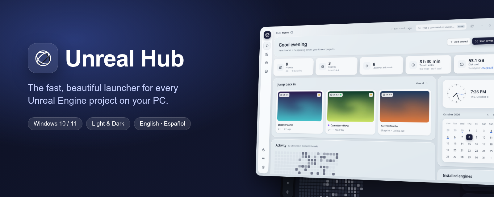
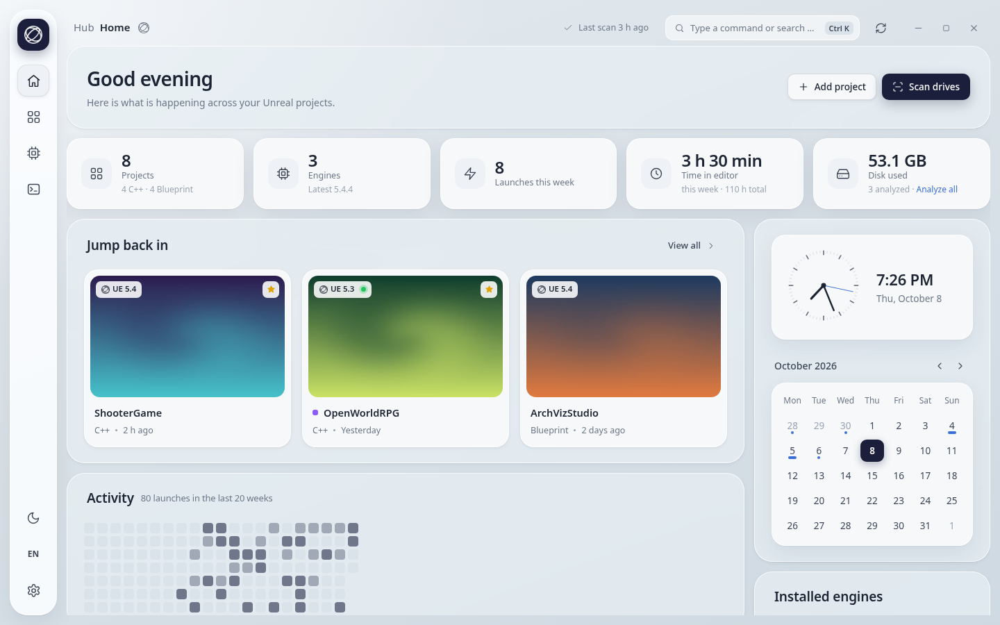
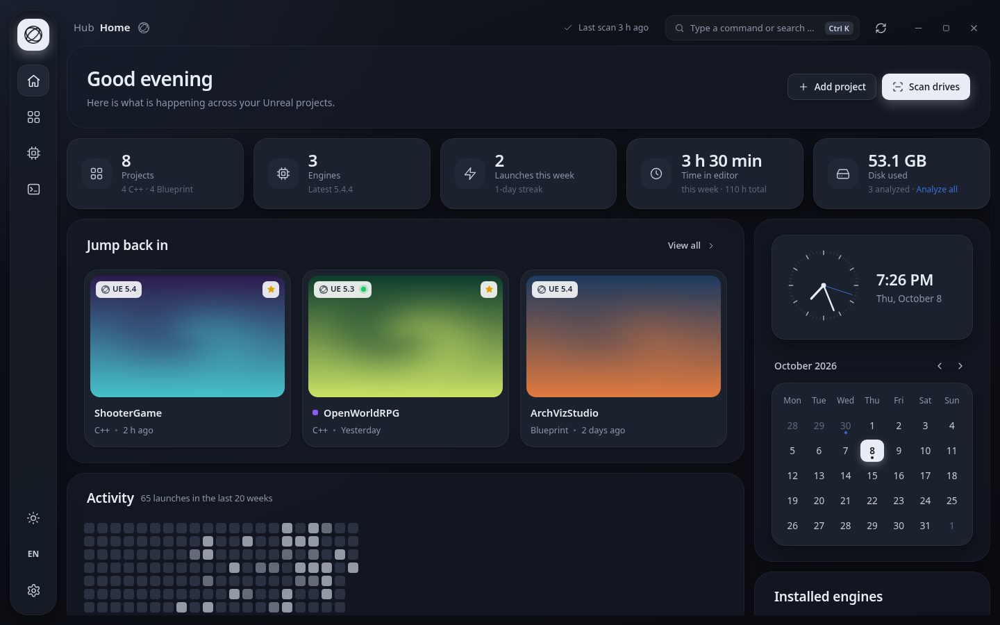
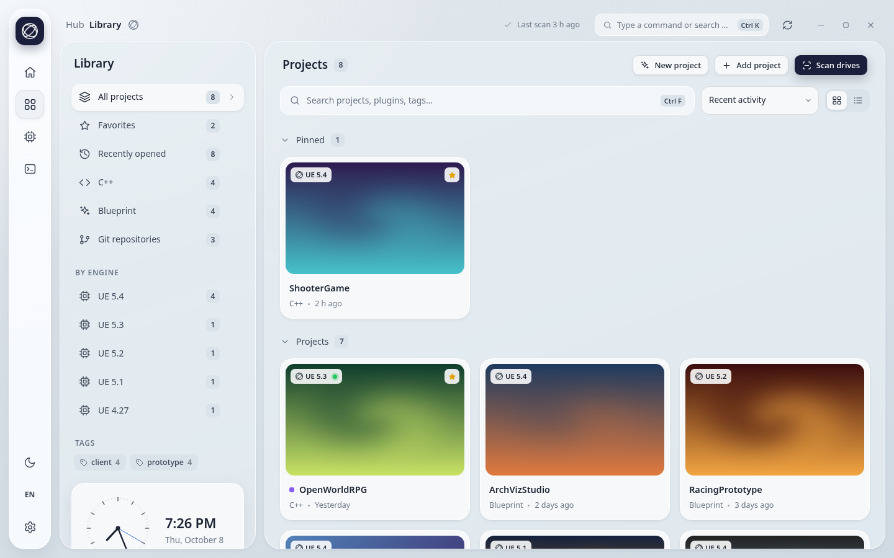
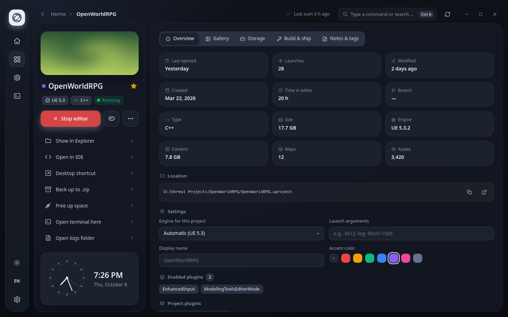
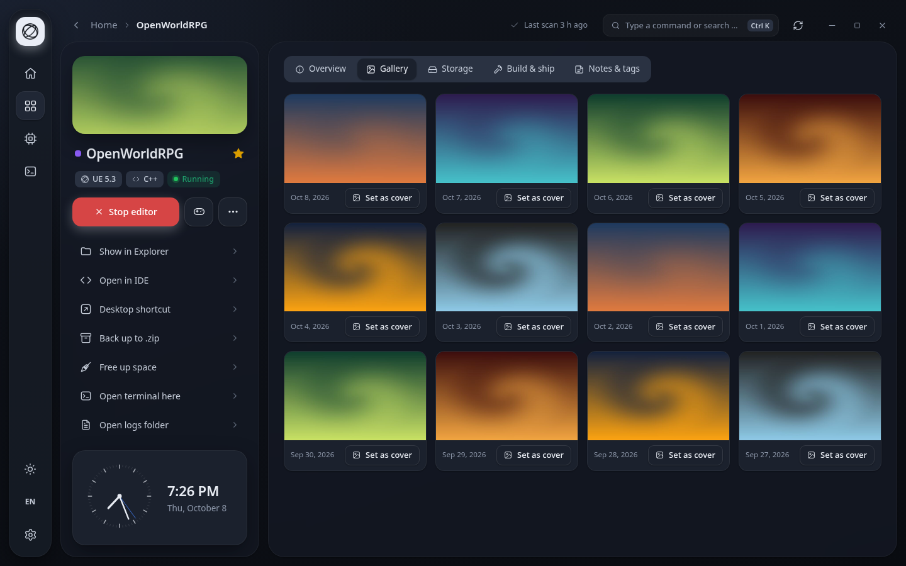
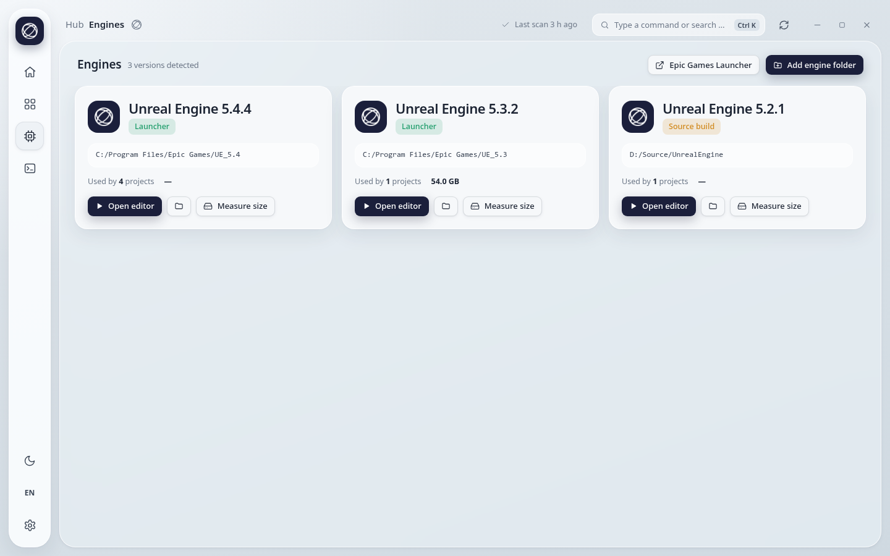
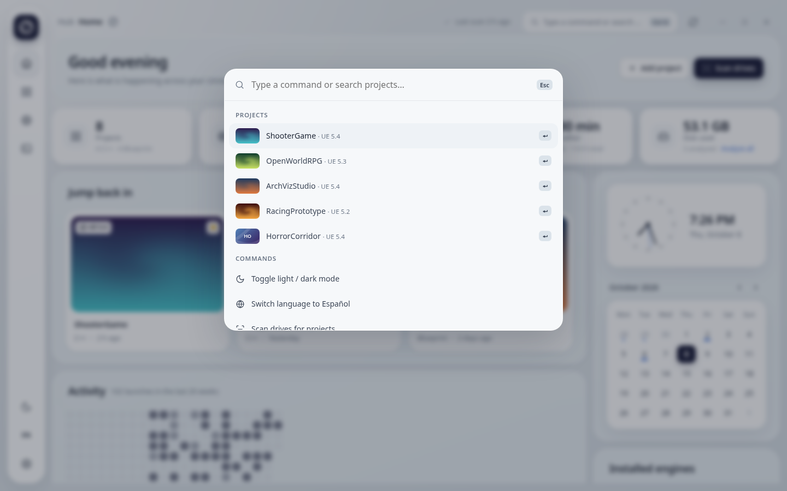
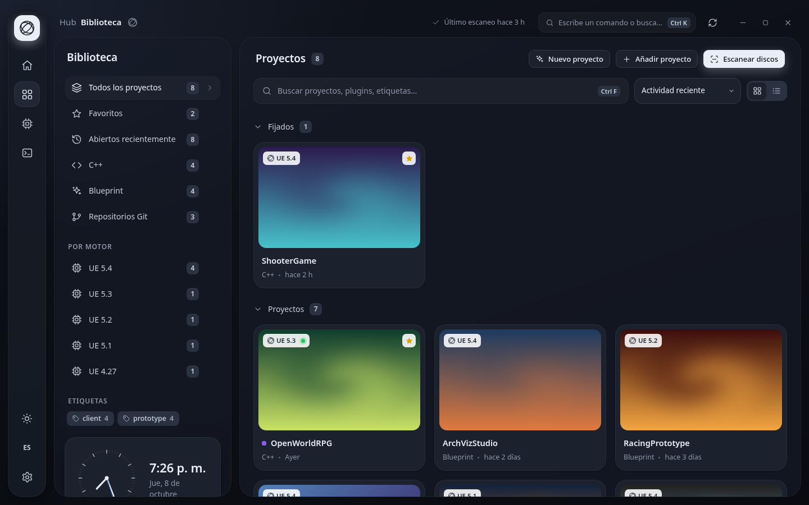
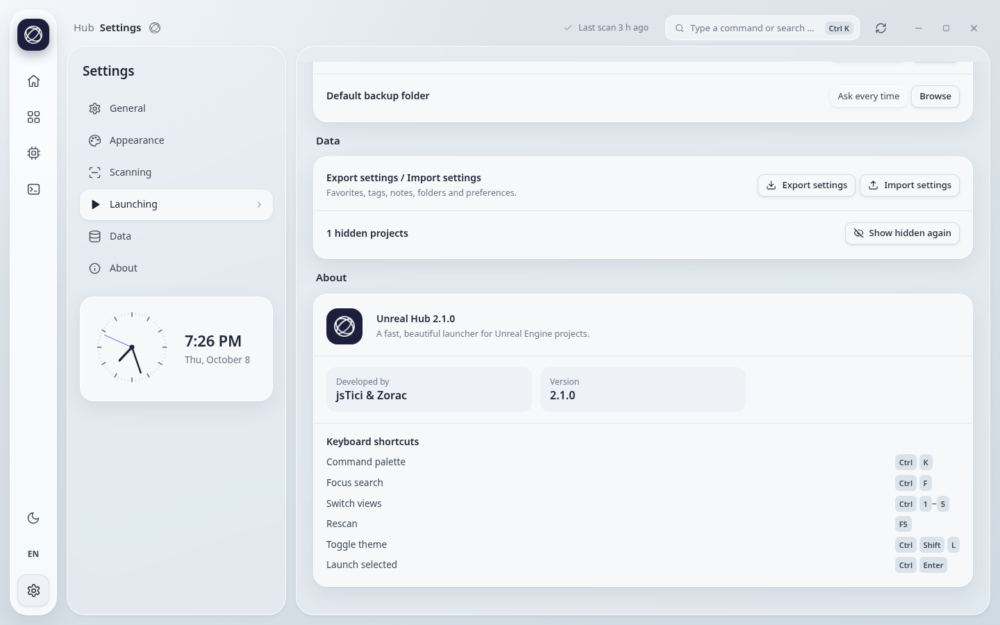

<div align="center">



<br/>


# Unreal Hub

**The fast, beautiful desktop launcher for every Unreal Engine project on your PC.**

Find all your projects in seconds, open them with one click, keep your engines tidy and see how you work — in a calm, glassy interface.

<br/>

[](https://github.com/jsTici/unreal-hub/releases/latest)
&nbsp;
[](https://github.com/jsTici/unreal-hub/releases)
&nbsp;
[](LICENSE)


[Features](#-features) · [Screenshots](#-screenshots) · [Install](#-install) · [Build from source](#-build-from-source) · [Credits](#-credits)

</div>

---

## Features

<table>
<tr>
<td width="50%" valign="top">

### 🔍 Your whole library, automatically
- Scans every drive + Unreal's own recent list
- Real project thumbnails, engine version, C++ / Blueprint, Git branch
- Favorites, pins, tags, notes, colors and custom names
- Instant search & filters by engine, type or tag

</td>
<td width="50%" valign="top">

### One click to work
- Open in editor, play standalone or launch with custom args
- **Live editor tracking** — see what's running, stop it, time spent per project
- Desktop shortcuts with the project's own picture as icon
- Taskbar jump list & tray menu with your recent projects

</td>
</tr>
<tr>
<td valign="top">

### Project tools
- Generate project files, compile C++, package (BuildCookRun)
- Fix up redirectors & compile all Blueprints
- Zip backup, duplicate, switch engine version
- Storage cleanup (Intermediate, DDC, Saved, logs…) with real sizes

</td>
<td valign="top">

### Made to feel good
- Soft-glass dashboard with clock, calendar & activity heatmap
- Light / dark / system theme and 7 accent colors
- **English** (default) and **Español**
- Command palette <kbd>Ctrl</kbd> + <kbd>K</kbd>, drag & drop, keyboard shortcuts

</td>
</tr>
<tr>
<td valign="top">

###  Gallery
- Browse every screenshot saved by your project
- Set any of them as the project cover in one click

</td>
<td valign="top">

###  Trustworthy
- Works 100% offline — no accounts, no telemetry
- Per-user install, **no admin rights**
- Clean uninstaller — your projects are never touched

</td>
</tr>
</table>

---

## 📸 Screenshots

<div align="center">

### Home


<br/><br/>

<table>
<tr>
<td align="center"><br/><sub><b>Dark mode</b></sub></td>
<td align="center"><br/><sub><b>Library</b> — filters by engine, type & tags</sub></td>
</tr>
<tr>
<td align="center"><br/><sub><b>Project page</b> — live editor session & tools</sub></td>
<td align="center"><br/><sub><b>Gallery</b> — screenshots & covers</sub></td>
</tr>
<tr>
<td align="center"><br/><sub><b>Engines</b> — Launcher & source builds</sub></td>
<td align="center"><br/><sub><b>Command palette</b> — <kbd>Ctrl</kbd>+<kbd>K</kbd></sub></td>
</tr>
<tr>
<td align="center"><br/><sub><b>Español</b> 🇪🇸</sub></td>
<td align="center"><br/><sub><b>Settings</b> & About</sub></td>
</tr>
</table>

</div>

---

## 📦 Install

1. Download **`UnrealHub-Setup-2.1.0.exe`** from [**Releases**](https://github.com/jsTici/unreal-hub/releases/latest).
2. Run it, choose your language and the options you want (desktop shortcut, Start menu, start with Windows).
3. Done — Unreal Hub scans your drives and shows all your projects.

> [!NOTE]
> The installer is not code-signed yet, so Windows SmartScreen may show *"Windows protected your PC"*. Click **More info → Run anyway**. You can verify the file with the SHA-256 checksum published in each release.

**Requirements:** Windows 10 or 11 (x64) and at least one Unreal Engine installed (Epic Games Launcher or source build).

---

## Build from source

```bash
git clone https://github.com/jsTici/unreal-hub.git
cd unreal-hub
npm install
npm start            # run in development
```

**Windows build + installer**

```powershell
npx electron-builder --win --dir                                    # -> dist\win-unpacked
& "C:\Program Files (x86)\NSIS\makensis.exe" build\installer.nsi   # -> dist\UnrealHub-Setup-2.1.0.exe
```

Requires [Node.js 18+](https://nodejs.org) and [NSIS 3](https://nsis.sourceforge.io).

<details>
<summary><b>Project structure</b></summary>

```
src/
├─ main.js            Electron main process (scanning, launching, tasks, tray, jump list)
├─ preload.js         Safe bridge between UI and system
├─ assets/            App icon & logo
└─ renderer/          UI — index.html, styles.css, app.js, i18n.js (EN/ES), icons.js
build/
├─ installer.nsi      Custom NSIS installer (EN/ES, per-user, clean uninstall)
└─ license.txt        License shown in the setup
```

</details>

---

## ⌨️ Keyboard shortcuts

| Action | Shortcut |
|---|---|
| Command palette | <kbd>Ctrl</kbd> + <kbd>K</kbd> |
| Focus search | <kbd>Ctrl</kbd> + <kbd>F</kbd> |
| Switch views | <kbd>Ctrl</kbd> + <kbd>1</kbd>–<kbd>5</kbd> |
| Rescan drives | <kbd>F5</kbd> |
| Toggle theme | <kbd>Ctrl</kbd> + <kbd>Shift</kbd> + <kbd>L</kbd> |
| Launch selected | <kbd>Ctrl</kbd> + <kbd>Enter</kbd> |

---

## 💜 Credits

<div align="center">

Designed & programmed by **jsTici** and **Zorac**.

Icons in the style of [Lucide](https://lucide.dev) (MIT)

*Unreal® and Unreal Engine® are trademarks of Epic Games, Inc. This project is not affiliated with or endorsed by Epic Games.*

<br/>

Released under the [MIT License](LICENSE) · If you like it, leave a ⭐

</div>
